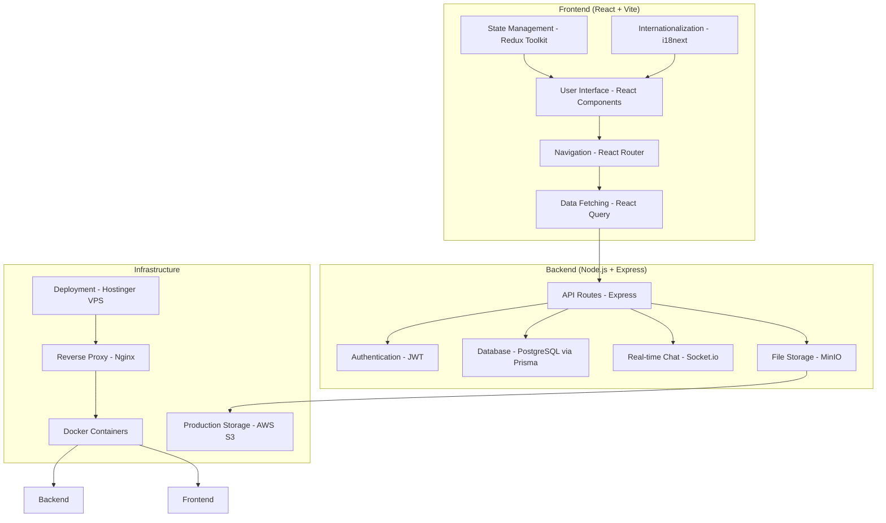
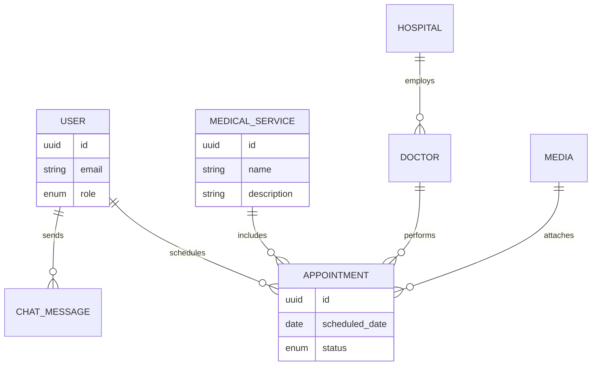

# AfayaConekt - Medical Tourism Platform

A comprehensive medical tourism platform connecting African patients with world-class healthcare providers globally.

## 🚀 Project Overview

AfayaConekt is a full-stack web application designed to facilitate medical tourism for African patients. The platform provides:

- **Comprehensive Medical Services**: Cardiology, Oncology, Orthopedics, Organ Transplants, Neurosciences, Gastroenterology, IVF, and Aesthetic Surgery
- **Multi-language Support**: English and French interfaces
- **Mobile-First Design**: Optimized for mobile devices with responsive web app capabilities
- **Real-time Communication**: Live chat system for patient-coordinator communication
- **Secure Architecture**: HIPAA-compliant data handling with modern security practices

## 🛠 Technology Stack

### Frontend
- **React 18** with TypeScript
- **Vite** for fast development and building
- **Tailwind CSS** for styling with custom design system
- **Redux Toolkit** for state management
- **React Query** for server state management
- **React Router** for navigation
- **Framer Motion** for animations
- **React i18next** for internationalization

### Backend
- **Node.js** with Express.js
- **TypeScript** for type safety
- **PostgreSQL** with Prisma ORM
- **Socket.io** for real-time communication
- **JWT** for authentication
- **MinIO** for file storage (S3-compatible)

### DevOps & Infrastructure
- **Docker** & **Docker Compose** for containerization
- **Nginx** for reverse proxy and load balancing
- **AWS S3** for production file storage
- **Hostinger VPS** for deployment

### System Architecture Diagram



## 📁 Project Structure

```
afayaS/
├── 📁 backend/                 # Node.js API server
│   ├── 📁 src/
│   │   ├── 📁 controllers/     # Request handlers
│   │   ├── 📁 services/       # Business logic
│   │   ├── 📁 models/         # Database models
│   │   ├── 📁 middleware/     # Custom middleware
│   │   ├── 📁 routes/         # API routes
│   │   ├── 📁 config/         # Configuration files
│   │   └── 📁 utils/          # Utility functions
│   ├── 📁 prisma/             # Database schema
│   └── 📁 tests/              # Test files
│
├── 📁 frontend/               # React application
│   ├── 📁 src/
│   │   ├── 📁 components/     # Reusable UI components
│   │   ├── 📁 pages/          # Page components
│   │   ├── 📁 hooks/          # Custom React hooks
│   │   ├── 📁 services/       # API services
│   │   ├── 📁 store/          # Redux store
│   │   ├── 📁 styles/         # Global styles
│   │   ├── 📁 i18n/           # Internationalization
│   │   └── 📁 types/          # TypeScript definitions
│   └── 📁 public/             # Static assets
│
├── 📁 database/               # Database files
│   └── 📁 init.sql           # Database initialization
│
├── 📁 nginx/                  # Nginx configuration
│   └── 📁 nginx.conf         # Reverse proxy config
│
├── 📁 docker-compose.yml     # Docker services
└── 📁 README.md              # Project documentation
```

## 🚀 Quick Start

### Prerequisites
- Docker and Docker Compose
- Node.js 18+ (for local development)
- Git
- PostgreSQL (for local development without Docker)

### Development Setup

1. **Clone the repository**
   ```bash
   git clone https://github.com/your-username/afayaconekt.git
   cd afayaS
   ```

2. **Start the development environment**
   ```bash
   docker-compose up -d
   ```

3. **Install dependencies (if running locally without Docker)**
   ```bash
   cd backend && npm install
   cd ../frontend && npm install
   ```

4. **Run database migrations**
   ```bash
   cd backend
   npx prisma generate
   npx prisma migrate dev
   ```

5. **Seed the database (optional, for testing)**
   ```bash
   npx prisma db seed
   ```

6. **Access the application**
   - Frontend: http://localhost:3000
   - Backend API: http://localhost:3001
   - API Documentation (Swagger): http://localhost:3001/api/docs
   - Prisma Studio (Database GUI): http://localhost:3001/prisma-studio

### Environment Variables

Copy the example environment files and configure them with your actual values (e.g., database credentials, JWT secrets, API keys):

```bash
# Backend
cp backend/.env.example backend/.env
# Edit backend/.env with your PostgreSQL connection string, JWT_SECRET, etc.

# Frontend
cp frontend/.env.example frontend/.env
# Edit frontend/.env with your API base URL, etc.
```

Key environment variables include:
- `DATABASE_URL`: PostgreSQL connection string
- `JWT_SECRET`: Secret for JWT token signing
- `MINIO_ENDPOINT`: MinIO server endpoint
- `REACT_APP_API_URL`: Backend API base URL for frontend

## 📊 Database Schema

The platform uses PostgreSQL with the following main entities (defined in Prisma schema):

- **Users**: Patients, coordinators, doctors, hospital admins (fields: id, email, role, profile data, etc.)
- **Medical Services**: Treatment categories and procedures (fields: id, name, description, category, price_range)
- **Hospitals & Doctors**: Healthcare provider network (fields: id, name, location, specialties, ratings)
- **Appointments**: Booking system with status tracking (fields: id, patient_id, doctor_id, service_id, status, date)
- **Chat System**: Real-time communication (fields: id, sender_id, receiver_id, message, timestamp)
- **Media Gallery**: Treatment photos and documents (fields: id, url, type, associated_entity_id)
- **Analytics**: Platform usage tracking (fields: id, event_type, user_id, timestamp, metadata)

### Entity Relationship Diagram (Simplified)



For full schema, see `backend/prisma/schema.prisma`.

## 🔐 Security Features

- **JWT Authentication** with refresh tokens and secure storage
- **Role-based Access Control (RBAC)**: Patients (view/book), Coordinators (manage chats), Admins (full access)
- **Data Encryption**: AES-256 at rest for sensitive health data; TLS 1.3 in transit
- **File Upload Security**: Virus scanning with ClamAV integration, size limits, allowed MIME types
- **Rate Limiting**: Express-rate-limit for API endpoints (e.g., 100 req/hour per IP)
- **CORS Protection**: Configured for frontend origin only
- **Input Validation**: Zod for schema validation, sanitization with express-validator
- **Audit Logging**: All user actions logged to a secure table for compliance (HIPAA/GDPR)

## 🌐 Internationalization

The platform supports:
- **English** (en) - Primary language
- **French** (fr) - Secondary language

Translation files are located in `frontend/src/i18n/locales/` with JSON format. Use `react-i18next` for dynamic switching based on user preference or browser locale.

## 📱 Mobile-First Design

- Fully responsive design using Tailwind's mobile-first breakpoints
- Touch-optimized interfaces with gesture support via Framer Motion
- Progressive Web App (PWA) features: Offline support, installable, push notifications (via service worker)
- Performance optimized: Lazy loading, code splitting with Vite

## 🔄 Development Workflow

### Backend Development
```bash
cd backend
npm run dev          # Start development server with nodemon
npm run build        # Build for production (tsc + esbuild)
npm run test         # Run tests with Jest
npm run lint         # Check code quality with ESLint
npm run format       # Format code with Prettier
```

### Frontend Development
```bash
cd frontend
npm run dev          # Start Vite dev server
npm run build        # Build for production
npm run preview      # Preview production build locally
npm run lint         # Check code quality with ESLint
npm run format       # Format code with Prettier
```

### Database Management
```bash
cd backend
npx prisma studio    # Open interactive database GUI
npx prisma migrate dev --name description # Create and apply new migration
npx prisma generate  # Regenerate Prisma client
npx prisma db push   # Sync schema without migration (dev only)
npx prisma seed      # Seed database with sample data for testing
```

### Testing the Full Stack
- Run `docker-compose up` for integrated services (DB, MinIO, etc.)
- Use Postman or Swagger for API testing
- Cypress or Playwright for end-to-end tests (to be added)

## 🚢 Deployment

### Production Deployment on Hostinger VPS
1. Build Docker images: `docker-compose build`
2. Push images to registry (e.g., Docker Hub) or transfer to VPS
3. Configure VPS: Install Docker, pull images, set env vars
4. Deploy: `docker-compose up -d` on VPS
5. Set up domain (e.g., via Hostinger panel) and SSL with Let's Encrypt
6. Configure monitoring: Integrate with tools like Sentry for errors, Prometheus for metrics

### CI/CD Pipeline (Recommended Setup)
- Use GitHub Actions or GitLab CI
- Steps: Lint → Test → Build → Migrate DB → Deploy to VPS
- Automated on push to main branch
- Include health checks: API endpoint pings, DB connectivity

Example GitHub Actions workflow in `.github/workflows/deploy.yml` (to be created).

## 📈 Monitoring & Analytics

- **Application Performance Monitoring**: New Relic or Datadog integration
- **User Behavior Analytics**: Google Analytics or Mixpanel for tracking patient journeys
- **Error Tracking**: Sentry for frontend/backend errors
- **Database Performance Metrics**: pgBadger for PostgreSQL logs
- **API Usage Statistics**: Custom logging with ELK stack (Elasticsearch, Logstash, Kibana)

## 🤝 Contributing

1. Fork the repository
2. Create a feature branch: `git checkout -b feature/amazing-feature`
3. Commit changes: `git commit -m 'Add amazing feature'`
4. Push to branch: `git push origin feature/amazing-feature`
5. Open a Pull Request

Guidelines:
- Follow TypeScript and ESLint rules
- Add tests for new features
- Update documentation
- Keep commits atomic and descriptive

## 📄 License

This project is licensed under the MIT License - see the [LICENSE](LICENSE) file for details.

## 🆘 Support

For support and questions:
- Email: support@afayaconekt.com
- Documentation: https://docs.afayaconekt.com
- Issue Tracker: https://github.com/your-username/afayaconekt/issues

## 🔄 Update Log

### Version 1.0.0 (Initial Release)
- Project setup with full-stack architecture
- Core UI components and responsive design
- Database schema and Prisma integration
- Docker configuration for local/prod environments
- Basic authentication and chat system
- Internationalization setup for EN/FR

### Future Versions
- v1.1.0: Advanced analytics and PWA features
- v1.2.0: Mobile app integration (React Native)
- v2.0.0: AI-powered treatment recommendations

---

**AfayaConekt** - Connecting African patients with world-class healthcare globally 🌍💙

*Last updated: October 2025 - Docker deployment optimized*